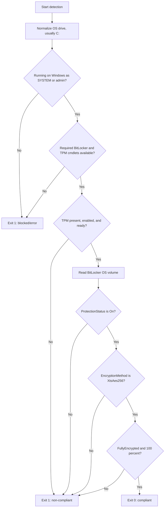
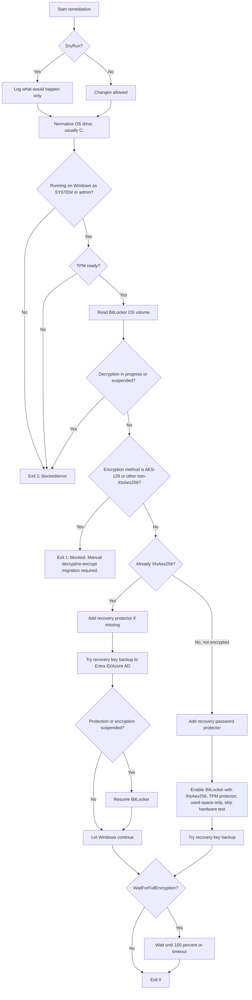

# BitLocker Detection and Remediation via Intune

Simple Microsoft Intune proactive remediation package for Windows OS drive BitLocker compliance.

This package checks that the Windows OS drive, usually `C:`, is protected with:

- TPM present, enabled, and ready
- BitLocker protection `On`
- Encryption method `XtsAes256`
- Volume status `FullyEncrypted`
- Encryption percentage `100`

## Files

| File | Purpose |
| --- | --- |
| `Detect-BitLockerAes256.ps1` | Intune detection script. It checks whether the device is already compliant. |
| `Remediate-BitLockerAes256.ps1` | Intune remediation script. It enables or resumes BitLocker when it is safe to do so. |
| `README.md` | Beginner-friendly setup, flow charts, testing steps, and reporting query. |

## What This Does

Think of the detection script as the checker and the remediation script as the fixer.

The checker asks:

1. Is TPM available and ready?
2. Is BitLocker protection turned on?
3. Is the OS drive using `XtsAes256`?
4. Is the drive fully encrypted?
5. Is encryption at 100 percent?

If all answers are yes, the device is compliant.

If any answer is no, Intune can run the remediation script.

## Detection Rules

The detection script returns compliant only when every rule below passes.

| Rule | Required value | If not matched |
| --- | --- | --- |
| Script context | Windows, running as SYSTEM or local admin | Exit `1` |
| TPM present | `True` | Exit `1` |
| TPM enabled | `True` | Exit `1` |
| TPM ready | `True` | Exit `1` |
| BitLocker protection | `On` | Exit `1` |
| Encryption method | `XtsAes256` | Exit `1` |
| Volume status | `FullyEncrypted` | Exit `1` |
| Encryption percentage | `100` | Exit `1` |

If all rules match, detection exits `0`.

The fixer will:

- Enable BitLocker if the OS drive is not encrypted and TPM is ready.
- Use `XtsAes256`.
- Use a TPM protector.
- Add a recovery password protector.
- Use used-space-only encryption.
- Skip the BitLocker hardware test.
- Try to back up the recovery key to Entra ID/Azure AD with `BackupToAAD-BitLockerKeyProtector` when that command exists.
- Resume BitLocker if protection or encryption is suspended.
- Leave Windows alone if encryption is already in progress.
- Block if decryption is in progress or suspended, so the script does not accidentally continue decrypting a device.
- Block instead of decrypting if the drive is already using AES-128 or another non-`XtsAes256` method.

## Detection Flow



## Remediation Flow



## Exit Code Meanings

### Detection Script

| Exit code | Meaning | Intune result |
| --- | --- | --- |
| `0` | Device is compliant. | No remediation needed. |
| `1` | Device is non-compliant, blocked, or an error occurred. | Remediation should run if assigned. |

### Remediation Script

| Exit code | Meaning |
| --- | --- |
| `0` | Remediation completed, started encryption, resumed protection, found a safe in-progress state, or completed dry run. |
| `1` | Remediation is blocked or failed. Check Intune logs/output. |

## Important AES-128 to AES-256 Warning

Windows cannot change a BitLocker encryption method in place.

If a drive is already encrypted with AES-128, `XtsAes128`, `Aes128`, `Aes256`, or another non-`XtsAes256` method, this remediation will not automatically decrypt and re-encrypt the drive.

That migration must be planned separately:

1. Back up the recovery key.
2. Decrypt the drive.
3. Re-enable BitLocker with `XtsAes256`.
4. Confirm recovery key escrow.

Do not run automatic decrypt/re-encrypt migrations without change control and user impact planning.

## Intune Deployment Settings

Create a proactive remediation script package in Intune with these settings:

| Setting | Value |
| --- | --- |
| Detection script | `Detect-BitLockerAes256.ps1` |
| Remediation script | `Remediate-BitLockerAes256.ps1` |
| Run scripts using logged-on credentials | `No` |
| Run script in 64-bit PowerShell | `Yes` |

Recommended assignment:

- Start with a small test group.
- Review detection output and remediation output.
- Expand only after confirming recovery key backup works in your tenant.

## How to Test Locally

Open 64-bit PowerShell as administrator on a Windows test device.

Check detection:

```powershell
.\Detect-BitLockerAes256.ps1
echo $LASTEXITCODE
```

Run remediation in dry-run mode first:

```powershell
.\Remediate-BitLockerAes256.ps1 -DryRun
echo $LASTEXITCODE
```

Run real remediation only after reviewing dry-run output:

```powershell
.\Remediate-BitLockerAes256.ps1
echo $LASTEXITCODE
```

Optional: wait for encryption to reach 100 percent:

```powershell
.\Remediate-BitLockerAes256.ps1 -WaitForFullEncryption
echo $LASTEXITCODE
```

Optional: target a specific OS drive if needed:

```powershell
.\Detect-BitLockerAes256.ps1 -MountPoint "C:"
.\Remediate-BitLockerAes256.ps1 -MountPoint "C:" -DryRun
```

## What Good Output Looks Like

Compliant detection example:

```text
[INFO] Starting BitLocker AES-256 detection for OS drive C:.
[INFO] TPM state: Present=True, Enabled=True, Ready=True.
[INFO] Volume state: ProtectionStatus=On, EncryptionMethod=XtsAes256, VolumeStatus=FullyEncrypted, EncryptionPercentage=100.
[COMPLIANT] Device is compliant. C: is protected with BitLocker XtsAes256, fully encrypted, and TPM is ready.
```

Blocked example:

```text
[BLOCKED] Volume is already encrypted or configured with 'XtsAes128'. Windows cannot change the BitLocker encryption method in place. Decrypt and re-encrypt as a separate migration if AES-256 is required.
```

## Notes for Intune Logs

The scripts write simple tagged output such as:

- `[INFO]`
- `[ACTION]`
- `[DRYRUN]`
- `[COMPLIANT]`
- `[NON-COMPLIANT]`
- `[BLOCKED]`
- `[ERROR]`

These messages are designed to be readable in Intune script output and troubleshooting logs.

## Microsoft Defender Advanced Hunting Query

Use this KQL query to report BitLocker non-compliant Windows workstations:

```kql
let BitLockerAssessments =
    DeviceTvmSecureConfigurationAssessment
    | where ConfigurationSubcategory =~ "Bitlocker"
    | where ConfigurationId in~ ("scid-2090", "scid-2091")
    | summarize arg_max(Timestamp, *) by DeviceId, ConfigurationId
    | where IsApplicable == true and IsCompliant == false
    | project
        DeviceId,
        ConfigurationId,
        AssessmentTimestamp = Timestamp,
        AssessmentDeviceName = DeviceName,
        AssessmentOSPlatform = OSPlatform,
        IsApplicable,
        IsCompliant,
        ConfigurationImpact,
        Context = tostring(Context);
let BitLockerKnowledge =
    DeviceTvmSecureConfigurationAssessmentKB
    | where ConfigurationSubcategory =~ "Bitlocker"
    | where ConfigurationId in~ ("scid-2090", "scid-2091")
    | project
        ConfigurationId,
        ConfigurationName,
        ConfigurationDescription,
        RiskDescription,
        RemediationOptions,
        Tags;
DeviceInfo
| where ingestion_time() > ago(1d)
| where OnboardingStatus =~ "Onboarded"
| where DeviceType =~ "Workstation"
| where OSPlatform in~ ("Windows10", "Windows11", "Windows 10", "Windows 11")
| summarize arg_max(Timestamp, *) by DeviceId
| join kind=inner BitLockerAssessments on DeviceId
| join kind=leftouter BitLockerKnowledge on ConfigurationId
| project
    Timestamp,
    DeviceId,
    ReportId,
    DeviceName,
    OSPlatform,
    OSVersion,
    MachineGroup,
    DeviceType,
    PublicIP,
    Model,
    Vendor,
    ConfigurationId,
    ConfigurationName,
    ConfigurationDescription,
    RiskDescription,
    RemediationOptions,
    ConfigurationImpact,
    AssessmentTimestamp,
    Context,
    LoggedOnUsers,
    Tags
```

## Safety Summary

This package enables BitLocker only when TPM is ready and the drive is not already encrypted with a different method.

It does not automatically decrypt drives.

It does not force-restart encryption when Windows is already encrypting.

Use `-DryRun` before real remediation.
